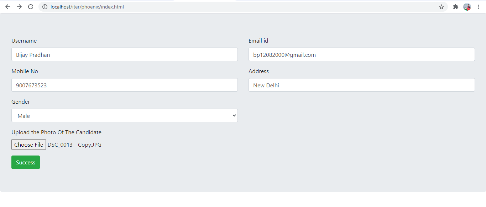
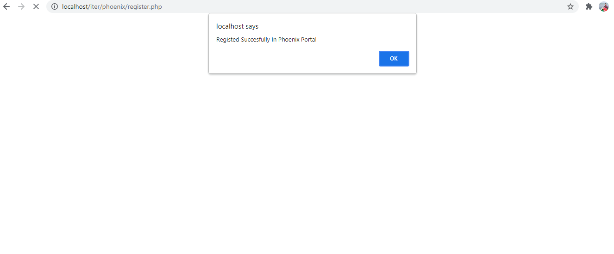
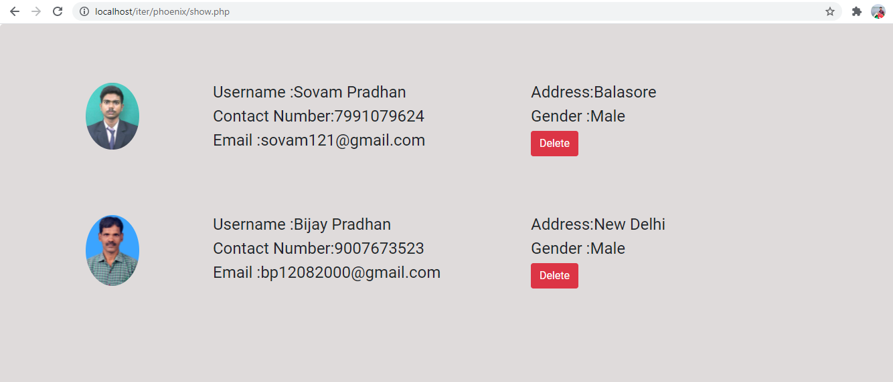
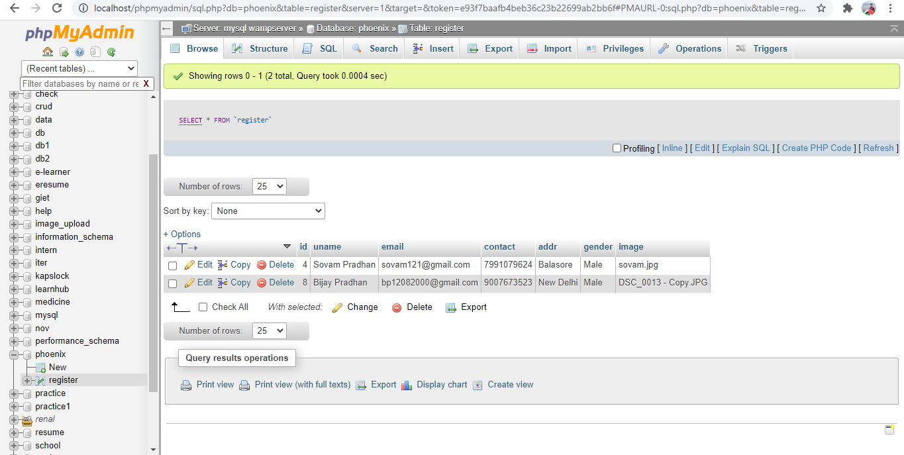

# PHP-Crud-App
<h4> The user have to fill the registration form which include Username,Mobile,Email,Address,Gender,Photo attribute</h4>

<h4> After Filling the Registration form you get window alert pop up for succesfully registered </h4>

<h4> In this page you can update and delete the account .</h4>

<h4> Database Schema </h4>

